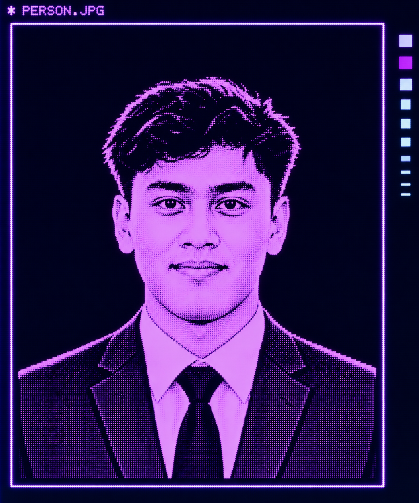

<!-- ========================================================= -->
<!--                    PROFILE HEADER                         -->
<!-- ========================================================= -->

<table width="100%">
<tr>

<!-- ===================== LEFT COLUMN ======================= -->

<td width="38%" align="center" valign="top">

  

<h1>Muhammad Haikal Bin Zulkifli</h1>

<h3>Electronics Engineering Graduate</h3>

Embedded Systems • Firmware • IoT

</td>

<!-- ===================== RIGHT COLUMN ====================== -->

<td width="62%" valign="top">

<h1>👨‍💻 Biodata</h1>

<table width="100%">

<tr>
<td width="25%"><b>Name</b></td>
<td>Muhammad Haikal Bin Zulkifli</td>
</tr>

<tr>
<td><b>Role</b></td>
<td>ASEM Trainee</td>
</tr>

<tr>
<td><b>Field</b></td>
<td>Embedded System</td>
</tr>

<tr>
<td><b>Education</b></td>
<td>Bachelor of Electronics Engineering (Hons.)</td>
</tr>

<tr>
<td><b>Studied at</b></td>
<td>Universiti Teknologi MARA (UiTM)</td>
</tr>

<tr>
<td colspan="2">
 
<h3>🏆 Achievement</h3>
</td>
</tr>

<tr>
<td align="center">🥇</td>
<td>Gold Award – i-RiSE 2025</td>
</tr>

<tr>
<td align="center">🥈</td>
<td>Silver Award – AIOTIE 2024</td>
</tr>

<tr>
<td align="center">🏅</td>
<td>Vice Chancellor Award Recipient</td>
</tr>

<tr>
<td align="center">🔬</td>
<td>R&amp;D Experience – MIMOS</td>
</tr>

<tr>
<td colspan="2">
 
<h3>💡 Main Interest</h3>
</td>
</tr>

<tr>
<td align="center">⚙️</td>
<td>Embedded Systems &amp; Firmware</td>
</tr>

<tr>
<td align="center">🌐</td>
<td>IoT &amp; Connected Devices</td>
</tr>

<tr>
<td align="center">🤖</td>
<td>Edge AI &amp; Computer Vision</td>
</tr>

<tr>
<td align="center">📡</td>
<td>Networking</td>
</tr>

</table>

</td>

</tr>
</table>

<!-- ========================================================= -->
<!--                    ABOUT ME                                -->
<!-- ========================================================= -->

 

<h2>🚀 About Me</h2>

I'm an <b>Electronics Engineering graduate from Universiti Teknologi MARA (UiTM)</b>
with a strong interest in embedded systems, firmware development, IoT,
electronics, and intelligent systems.

I enjoy building practical solutions that combine <b>hardware and software</b>,
from microcontroller-based systems and sensor integration to IoT and
AI-powered applications.

<!-- ========================================================= -->
<!--                    TECHNICAL SKILLS                        -->
<!-- ========================================================= -->

<h2>🛠️ Technical Skills</h2>

<table width="100%">

<tr>

<td width="50%" valign="top">

<h3>💻 Programming Languages</h3>

<h3>⚙️ Embedded Systems</h3>

<h3>🔌 Electronics</h3>

<ul>
<li>Sensor Integration</li>
<li>Microcontroller Interfacing</li>
<li>GPIO</li>
<li>ADC</li>
<li>UART</li>
<li>SPI</li>
<li>I2C</li>
</ul>

</td>

<td width="50%" valign="top">

<h3>🤖 AI &amp; Computer Vision</h3>

<ul>
<li>Machine Learning</li>
<li>Deep Learning</li>
<li>Computer Vision</li>
<li>Edge AI</li>
<li>TensorFlow Lite</li>
</ul>

<h3>🌐 IoT &amp; Networking</h3>

<ul>
<li>Blynk</li>
<li>Wi-Fi Communication</li>
<li>IP Addressing</li>
<li>Cisco IOS CLI</li>
<li>Networking Fundamentals</li>
</ul>

<h3>🔧 Development Tools</h3>

<ul>
<li>Git &amp; GitHub</li>
<li>Arduino IDE</li>
<li>Proteus</li>
<li>LTspice</li>
<li>Unity</li>
<li>Vuforia</li>
<li>Android Studio</li>
</ul>

</td>

</tr>

</table>

<!-- ========================================================= -->
<!--                    FEATURED PROJECTS                       -->
<!-- ========================================================= -->

<h2>🚀 Featured Projects</h2>

<table width="100%">

<tr>

<td width="50%" valign="top">

<h3>👓 Smart Eyeglasses for Driving Safety</h3>

An embedded safety system designed to detect prolonged eye closure
using infrared sensors and provide warning alerts to improve
driving safety.

🏆 <b>Gold Award – i-RiSE 2025</b>

<b>Technologies:</b>

<code>Embedded C</code>
<code>IR Sensor</code>
<code>Microcontroller</code>
<code>OLED</code>

</td>

<td width="50%" valign="top">

<h3>♻️ Edge AI Waste Classification</h3>

An intelligent waste classification and sorting system using
computer vision and edge AI to identify different types of waste
and control a mechanical sorting mechanism.

<b>Technologies:</b>

<code>Raspberry Pi</code>
<code>ESP32</code>
<code>TensorFlow Lite</code>
<code>OpenCV</code>
<code>Python</code>

</td>

</tr>

<tr>

<td width="50%" valign="top">

<h3>📡 AR Network Visualization</h3>

A marker-based Augmented Reality application that visualizes
network device information including IP addresses, MAC addresses,
hostnames and port status.

<b>Technologies:</b>

<code>Unity</code>
<code>Vuforia</code>
<code>Networking</code>
<code>Telnet</code>

</td>

<td width="50%" valign="top">

<h3>🔥 Smart Gas Leakage Detection</h3>

An IoT-based gas monitoring system using an MQ-2 gas sensor,
ESP32 and NodeMCU for gas detection and remote monitoring.

<b>Technologies:</b>

<code>ESP32</code>
<code>NodeMCU</code>
<code>MQ-2</code>
<code>Blynk</code>

🎥 <b>Watch the Demonstration</b>

</td>

</tr>

<tr>

<td width="50%" valign="top">

<h3>🧳 Smart Suitcase</h3>

A Bluetooth-controlled smart suitcase prototype with a custom
mobile application for wireless control.

<b>Technologies:</b>

<code>Arduino</code>
<code>Bluetooth</code>
<code>MIT App Inventor</code>

</td>

<td width="50%" valign="top">

<h3>📊 Sensor Monitoring System</h3>

A sensor-based monitoring system designed to collect,
process and display environmental or system data.

<b>Technologies:</b>

<code>ESP32</code>
<code>Sensors</code>
<code>IoT</code>
<code>Blynk</code>

</td>

</tr>

</table>

<!-- ========================================================= -->
<!--                    AWARDS                                  -->
<!-- ========================================================= -->

<h2>🏆 Awards &amp; Achievements</h2>

<table width="100%">

<tr>

<td align="center" width="33%">

<h1>🥇</h1>

<b>Gold Award</b>

 

i-RiSE 2025

</td>

<td align="center" width="33%">

<h1>🥈</h1>

<b>Silver Award</b>

 

AIOTIE 2024

</td>

<td align="center" width="33%">

<h1>🏅</h1>

<b>Vice Chancellor Award</b>

 

UiTM

</td>

</tr>

</table>

<!-- ========================================================= -->
<!--                    CURRENT LEARNING                        -->
<!-- ========================================================= -->

<h2>📚 Currently Learning</h2>

<ul>

<li>Embedded Firmware Development</li>
<li>Advanced C &amp; C++</li>
<li>STM32 Microcontroller Development</li>
<li>IoT System Development</li>
<li>Edge AI Deployment</li>
<li>Computer Vision</li>
<li>Networking &amp; Embedded Communication</li>

</ul>

<!-- ========================================================= -->
<!--                    GITHUB STATS                            -->
<!-- ========================================================= -->

<h2>📊 GitHub Statistics</h2>

<!-- ========================================================= -->
<!--                    CONTRIBUTIONS                           -->
<!-- ========================================================= -->

<h2>📈 Contribution Activity</h2>

<!-- ========================================================= -->
<!--                    CONNECT                                 -->
<!-- ========================================================= -->

<h2>📫 Let's Connect</h2>

<table width="100%">

<tr>

<td align="center" width="50%">

<h3>📧 Email</h3>

<a href="mailto:haikalzulkifli2002@gmail.com">
haikalzulkifli2002@gmail.com
</a>

</td>

<td align="center" width="50%">

<h3>💼 LinkedIn</h3>

<a href="https://www.linkedin.com/in/haikal-zulkifli-724884254/">
LinkedIn Profile
</a>

</td>

</tr>

</table>

<!-- ========================================================= -->
<!--                    FOOTER                                  -->
<!-- ========================================================= -->

 

<h3>
⚙️ Embedded Systems • Firmware • IoT • Electronics • Edge AI
</h3>

<i>
"Building practical solutions through electronics and technology."
</i>

