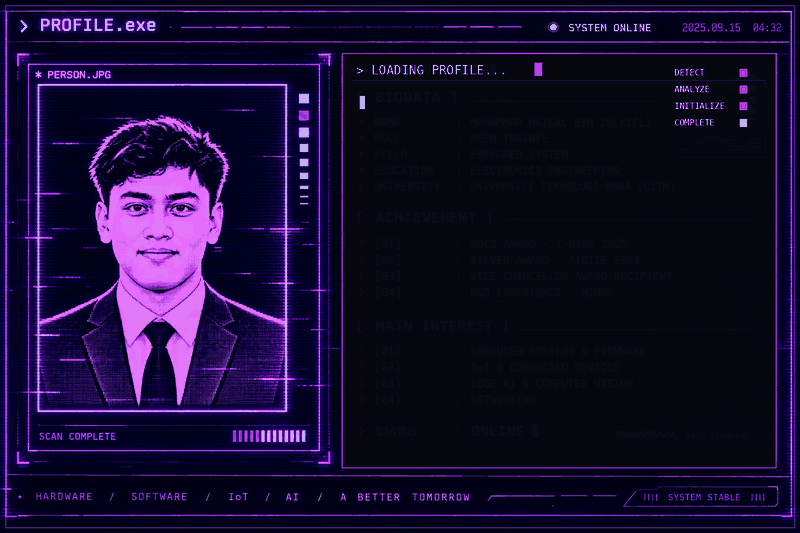

<!-- ========================================================= -->
<!--                  MUHAMMAD HAIKAL                          -->
<!--              CYBERPUNK GITHUB PROFILE                    -->
<!-- ========================================================= -->

<!-- ========================================================= -->
<!--                  CYBER PROFILE HUD                       -->
<!-- ========================================================= -->

 

<!-- ========================================================= -->
<!--                    NEON DIVIDER                           -->
<!-- ========================================================= -->

 

<!-- ========================================================= -->
<!--                  PROJECT DATABASE                         -->
<!-- ========================================================= -->

 

<!-- ========================================================= -->
<!--                    PROJECTS                               -->
<!-- ========================================================= -->

<table width="100%" cellpadding="18" cellspacing="12">

<!-- ========================================================= -->
<!--                 PROJECT 01 + 02                           -->
<!-- ========================================================= -->

<tr>

<!-- PROJECT 01 -->

<td width="50%" valign="top" bgcolor="#090B12">

<h2>01 // SMART EYEGLASSES</h2>

<b>PROJECT STATUS</b>

<code>[ COMPLETED ]</code>

<b>DESCRIPTION</b>

An embedded driver safety system designed to detect prolonged eye closure and provide warning alerts.

<b>SYSTEM CORE</b>

<pre>
MCU       → STM32
LANGUAGE  → Embedded C
SENSOR    → IR Sensor
DISPLAY   → OLED
</pre>

<b>KEY FEATURE</b>

<pre>
IR SENSOR
    ↓
EYE CLOSURE DETECTION
    ↓
PROCESSING
    ↓
WARNING ALERT
</pre>

<b>ACHIEVEMENT</b>

<code>GOLD AWARD // i-RiSE 2025</code>

</td>

<!-- PROJECT 02 -->

<td width="50%" valign="top" bgcolor="#090B12">

<h2>02 // AR NETWORK</h2>

<b>PROJECT STATUS</b>

<code>[ COMPLETED ]</code>

<b>DESCRIPTION</b>

An Augmented Reality application designed to visualize network device information and network status through AR.

<b>SYSTEM CORE</b>

<pre>
ENGINE     → Unity
AR         → Vuforia
NETWORK    → Telnet
TESTING    → Packet Tracer
</pre>

<b>VISUALIZATION</b>

<pre>
ROUTER
SWITCH
IP ADDRESS
MAC ADDRESS
PORT STATUS
</pre>

<b>SYSTEM</b>

<code>AR // NETWORK VISUALIZATION</code>

</td>

</tr>

<!-- ========================================================= -->
<!--                 PROJECT 03 + 04                           -->
<!-- ========================================================= -->

<tr>

<!-- PROJECT 03 -->

<td width="50%" valign="top" bgcolor="#090B12">

<h2>03 // GAS DETECTION</h2>

<b>PROJECT STATUS</b>

<code>[ COMPLETED ]</code>

<b>DESCRIPTION</b>

An IoT-based gas leakage detection system capable of monitoring gas levels and providing remote monitoring.

<b>SYSTEM CORE</b>

<pre>
MCU       → ESP32
NETWORK   → NodeMCU
SENSOR    → MQ-2
IoT       → Blynk
</pre>

<b>SYSTEM FLOW</b>

<pre>
MQ-2 SENSOR
     ↓
ESP32
     ↓
WiFi
     ↓
BLYNK
     ↓
REMOTE MONITORING
</pre>

<b>DEMO</b>

</td>

<!-- PROJECT 04 -->

<td width="50%" valign="top" bgcolor="#090B12">

<h2>04 // SMART SUITCASE</h2>

<b>PROJECT STATUS</b>

<code>[ COMPLETED ]</code>

<b>DESCRIPTION</b>

A smart luggage concept designed to provide wireless control through a mobile application.

<b>SYSTEM CORE</b>

<pre>
MCU        → Arduino
WIRELESS   → Bluetooth
MOBILE APP → MIT App Inventor
</pre>

<b>CONTROL</b>

<pre>
MOBILE APP
     ↓
BLUETOOTH
     ↓
ARDUINO
     ↓
SMART SUITCASE
</pre>

<b>SYSTEM</b>

<code>IoT // WIRELESS CONTROL</code>

</td>

</tr>

<!-- ========================================================= -->
<!--                    PROJECT 05                             -->
<!-- ========================================================= -->

<tr>

<td width="50%" valign="top" bgcolor="#090B12">

<h2>05 // SENSOR MONITOR</h2>

<b>PROJECT STATUS</b>

<code>[ COMPLETED ]</code>

<b>DESCRIPTION</b>

An IoT monitoring system designed to collect sensor data and display the information through a cloud dashboard.

<b>SYSTEM CORE</b>

<pre>
MCU        → ESP32
SENSORS    → Multiple Sensors
IoT        → Blynk
MONITORING → Cloud Dashboard
</pre>

<b>SYSTEM FLOW</b>

<pre>
SENSORS
   ↓
ESP32
   ↓
WiFi
   ↓
BLYNK
   ↓
MONITORING DASHBOARD
</pre>

<b>SYSTEM</b>

<code>IoT // SENSOR MONITORING</code>

</td>

<td width="50%" valign="top">

</td>

</tr>

</table>

 

<!-- ========================================================= -->
<!--                    NEON DIVIDER                           -->
<!-- ========================================================= -->

 

<!-- ========================================================= -->
<!--                    FINAL STATUS                           -->
<!-- ========================================================= -->

  

  

<code>⚡ EMBEDDED SYSTEMS • FIRMWARE • IoT • ELECTRONICS • EDGE AI</code>

  

<code>[ SYSTEM STATUS : ONLINE ]</code>

